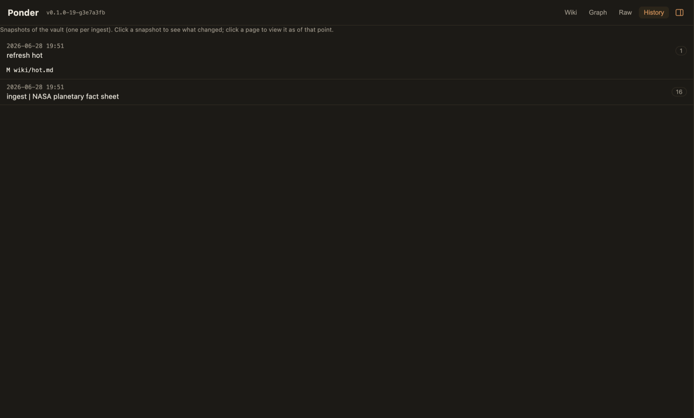

# Ponder — downloads

Signed & notarized macOS builds of **Ponder**, a local-first LLM-Wiki second brain
(the code lives in a private repo; this repo hosts the downloads + auto-update feed).

## What it looks like

*Claude Code is the brain — it reads your sources and builds an interlinked wiki, and you review every change.*

*An interlinked wiki: backlinks, tags, and health checks (orphans · dead links · contradictions).*

*See how everything connects.*

*Keyboard-driven: ⌘P to jump to any page or run a command.*

*Every change is a reviewable git diff — accept, reject, or time-travel.*

## Download

Grab the latest **`Ponder-<version>-arm64.dmg`** from the
[**Releases**](../../releases/latest) page, open it, and drag **Ponder** to
Applications. The app updates itself from here after that.

## Requirements

- macOS (Apple Silicon)
- [**Claude Code**](https://claude.com/claude-code) installed and logged in — Ponder's brain
- **git**
